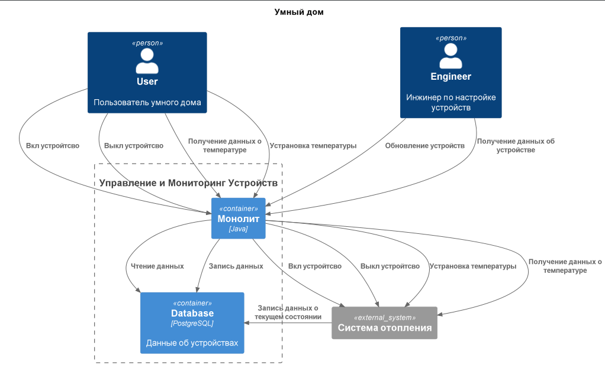
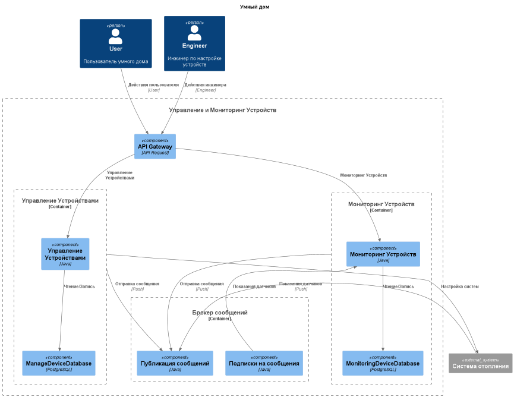
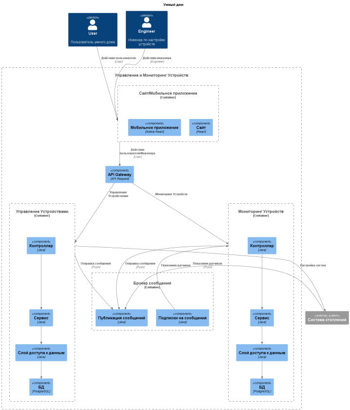
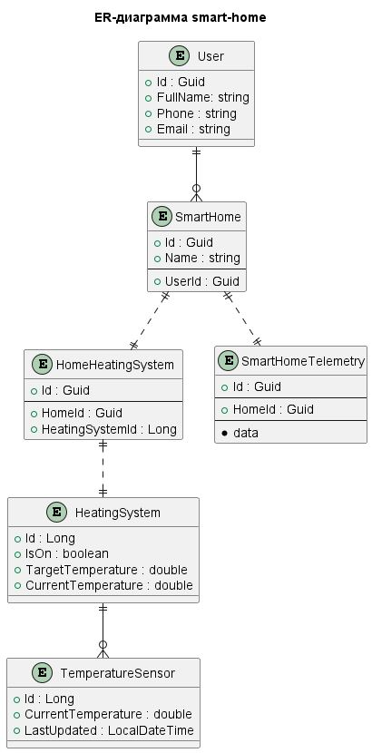

# Задание 1.1.

## Функциональность

Управление отоплением:

- Пользователи могут удалённо включать/выключать отопление в своих домах.
- Пользователи могут устанавливать желаемую температуру.
- Система автоматически поддерживает заданную температуру, регулируя подачу тепла.

Мониторинг температуры:

- Система получает данные о температуре с датчиков, установленных в домах.
- Пользователи могут просматривать текущую температуру в своих домах через веб-интерфейс.

## Архитектура

- Язык программирования: Java
- База данных: PostgreSQL
- Архитектура: Монолитная, все компоненты системы (обработка запросов, бизнес-логика, работа с данными) находятся в рамках одного приложения.
- Взаимодействие: Синхронное, запросы обрабатываются последовательно.
- Масштабируемость: Ограничена, так как монолит сложно масштабировать по частям.
- Развертывание: Требует остановки всего приложения.

## Структура проект

Проект организован в соответствии со стандартной структурой Maven/Gradle проекта:

- **Основной класс приложения** аннотирован `@SpringBootApplication`.
- **Пакеты**:
    - `controller` - контроллеры для обработки HTTP-запросов. `HeatingSystemController`
    - `service` - сервисы для бизнес-логики. `HeatingSystemService, HeatingSystemServiceImpl`
    - `repository` - репозитории для доступа к базе данных. `HeatingSystemRepository, TemperatureSensorRepository`
    - `entity` - сущности JPA. `HeatingSystem, TemperatureSensor`
    - `dto` - объекты передачи данных (DTO). `HeatingSystemDto`

## Зависимости

Проект использует следующие зависимости:

- Java 17
- Maven >=3.8.1 && <4.0.0
- `spring-boot-starter-web` - для создания веб-приложений.
- `spring-boot-starter-data-jpa` - для работы с JPA и базой данных.
- `postgresql` - драйвер для работы с PostgreSQL.
- `springfox-boot-starter` - для интеграции Swagger.
- `lombok` - для упрощения написания кода.
- `spring-boot-starter-test`, `spring-boot-testcontainers`, `junit-jupiter`, `testcontainers` - для тестирования.

## Запуск

1.

``` shell
docker run --name postgres-db -e POSTGRES_DB=smart_home -e POSTGRES_USER=your_username -e POSTGRES_PASSWORD=your_password -p 5432:5432 -d postgres:13-alpine
```

2.

``` shell
mvn spring-boot:run
```

## Тесты

``` shell
mvn test
```

## Конфигурация

### Подключение к базе данных

Конфигурация подключения к PostgreSQL находится в файле `application.yml`:

```yaml
spring:
  datasource:
    url: jdbc:postgresql://localhost:5432/smart_home
    username: user
    password: password
  jpa:
    hibernate:
      ddl-auto: update
    show-sql: true
```

## Логирование

В проекте используется SLF4J для логирования.

## Тестирование

В проекте написаны модульные тесты для сервисов и контроллеров.

## Домены и границы контекстов

Домен Управление Устройствами:
  - Поддомен Управления Устройствами:
    - Контекст: Включение устройства `turnOn`
    - Контекст: Выключение устройства `turnOff`

  - Поддомен Обновления Устройств:
    - Контекст: Обновление устройств `updateHeatingSystem`
    
  - Поддомен Управления Температурой Устройств:
    - Контекст: Установка желаемой температуры `setTargetTemperature`

Домен Мониторинг Устройств:
  - Поддомен Получения Данных о Температуре Устройств:
      - Контекст: Получение данных о текущей температуре `getCurrentTemperature`

  - Поддомен Мониторинга Устройств:
      - Контекст: Получение данных об устройстве `getHeatingSystem`

## C4 диаграма

[puml файл](./Task1_1/Task1_1.puml)




# Задание 1.2.

## Декомпозиция на микросервисы

Исходя из выделенных доменов можно выделить 2 микросервиса:
- Управление Устройствами
- Мониторинг Устройств

Так же возможно нам понадобятся
- Сервис регистрации/авторизации пользователей
- Сервис профиля пользователя

Но на данный момент нет ресурсов для разработки дополнительных 
сервисов(и в ТЗ не прописаны требования)

## Определение взаимодействия

- Как пользователи системы так и инженеры могут использовать веб/мобильное приложение
- Веб/мобильное приложение взаимодействуют с системой через `API Gateway`
- Микросервисы обмениваются данными между собой через брокер сообщений `Kafka`


## Визуализация архитектуры

### Диаграмма контейнеров

[puml файл](./Task1_2/Task1_2_Containers.puml)



### Диаграмма компонентов

[puml файл](./Task1_2/Task1_2_Components.puml)



### Уровень кода

На данный момент критичных частей системы не выявленно, нет необходимости рисовать диаграмму на уровне кода, но возможно она понадобится на стадии разработка или тестирования

# Задание 1.3.

[puml файл](./Task1_3/Task1_3.puml)



# Задание 1.4.

[Сгененрированная документация](./Task1_4/site)
